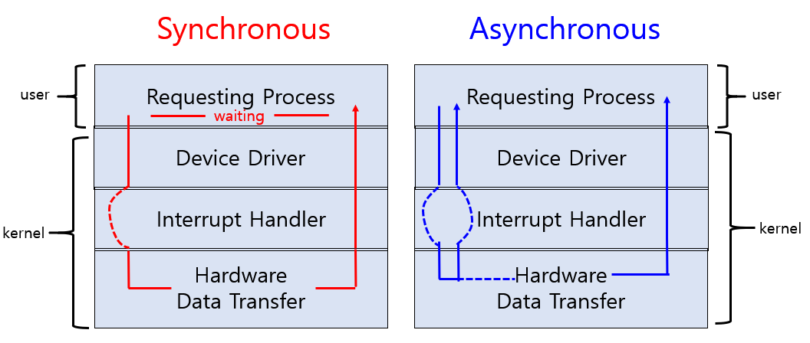
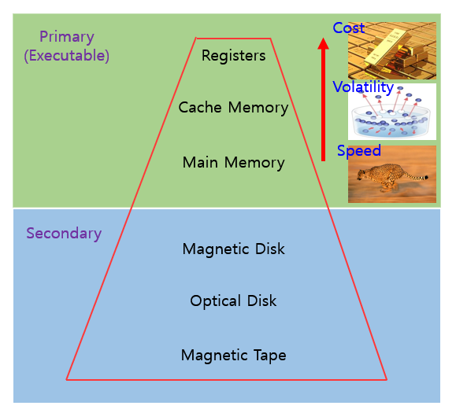
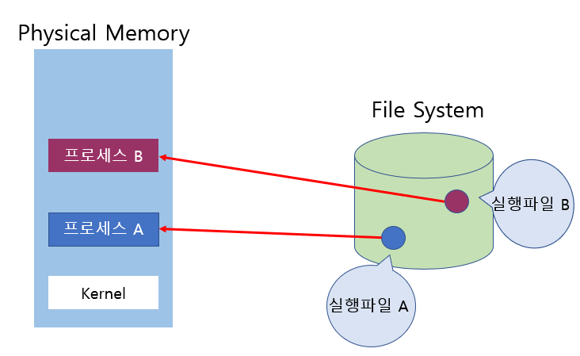
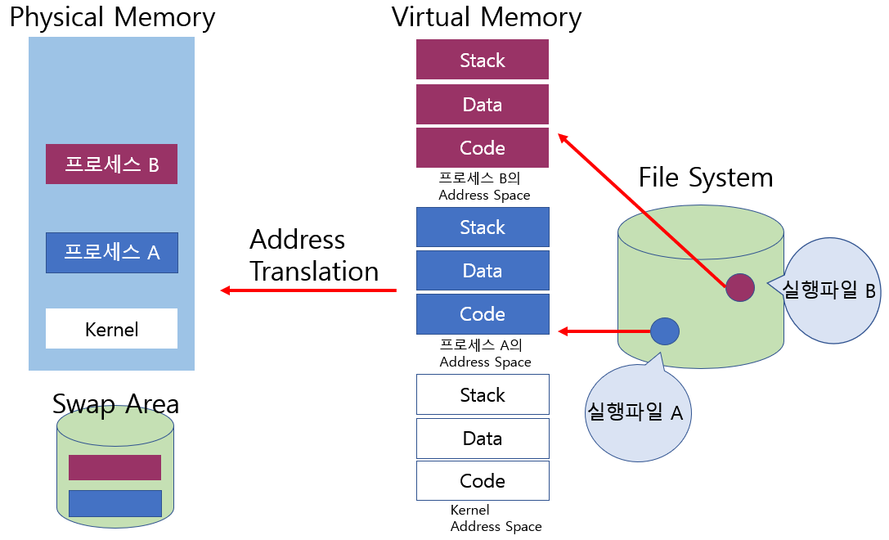
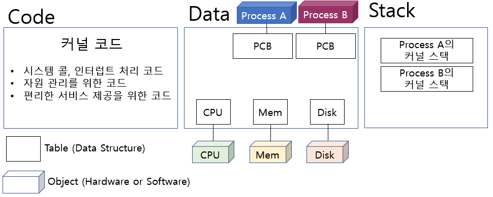

# 1. 시스템 구조
> CPU는 매순간 Memory 어딘가에 올라와 있는 기계어를 처리한다.   
Instruction(크기 약 4 Byte) 읽어서 실행.    
(<u>기계어를 하나 읽어오고 실행하는 일을 반복적으로 한다.</u> ***Fetch & Execution***) 

그렇다면 메모리 위치를 어떻게 아는가?   
=> Registers 중에 메모리 주소를 가르키는 Register가 존재. => **Program Counter** 라고 한다.

CPU는 Program Counter가 가르키는 주소에서 Instruction을 꺼내와서 실행하는 일을 반복적으로 수행한다.   
***Program Counter는 CPU가 하나 꺼내갔을 때, 다음 주소를 가르킨다.***    

Instruction을 읽어서 실행한 후,   
다음 Instruction을 실행하기 전에 하는 일 => Interrupt가 들어왔는지 체크하는 일.    
만약 Interrupt가 존재한다면,  
Program Counter가 가르키는 주소에서 Instruction을 가져오는 것이 아니라    
지금 하던 작업을 멈추고 CPU를 누가 쓰고 있었던지 제어권이 운영체제에게 넘어가게 된다.

# 2. 인터럽트(Interrupt)
> 운영체제는 인터럽트마다 무슨 인터럽트가 걸렸는지 상황에 따라 처리해야하는 일들이 커널 함수로 정의 되어있다.

- **인터럽트 벡터**란?  
  - 각 인터럽트 종류별로 몇번 라인의 인터럽트가 들어왔는지에 나타내는 엔트리,   
  - 그 엔트리가 들어왔을 때, 메모리 어디에 있는 Instruction들을 처리해야하는가에 대한 주소,    
  
  => 번호와 주소의 쌍을 갖고 있는 것

- **인터럽트 처리 루틴**이란?  
=> 해당하는 함수에 가면 CPU에서 처리해야할 함수 및 처리해야할 일들

cf) 사용자 프로그램이 무언가 입력을 받아야한다면 의도적으로 Interrupt Line을 셋팅한다.  
(I/O는 운영체제 모드에서만 가능하다)  
즉, 이런식으로 운영체제에게 서비스를 요청하는 것을 **시스템콜**이라고 한다. 
\- 인터럽트 종류
- **Interrupt(하드웨어 인터럽트)** : I/O Controller, Timmer
- **Trap(소프트웨어 인터럽트)** : Exception, System Call

# 3. 동기식 입출력과 비동기식 입출력
- **동기식 입출력 (Synchronous I/O)**   
  : I/O 요청 후 입출력 작업이 완료된 후에야 제어가 사용자 프로그램에 넘어감.
- **비동기식 입출력 (Asynchronous I/O)**    
  : I/O가 시작된 후 입출력 작업이 끝나기를 기다리지 않고 제어가 사용자 프로그램에 즉시 넘어감.

# 4. 저장장치 계층 구조

- Primary(Excecutable)은 CPU가 직접 접근 가능함.  
( Byte 단위로 접근이 가능하다는 뜻)
- Secondary은 CPU가 직접 접근 하지 못함.  
(Sector 단위로 접근가능)

# 5. 프로그램 실행 (메모리 load)

> 프로그램들은 실행파일로 하드디스크에 저장되어있다.    
실행파일 실행시키면 메모리에 올라가는데 이것을 **프로세스**라 한다.

정확하게는 ***물리적 메모리에 바로 올라가지 않고 중간에 Virtual Memory를 거치게 된다.***    
프로그램을 실행시키면 프로그램의 **Address Space** (0번지부터 시작하는 그프로그램만의 독자적인 주소 공간)이 만들어짐.

- Stack : 함수 호출 및 리턴   
- Data  : 변수, 전역변수, 자료구조   
- Code  : 프로그램 기계어 코드   

=> 사용자 프로그램은 실행시키면 만들어진 주소공간이 생기고 종료시키면 공간 사라짐.    
==> 이를 물리적 메모리에 올려서 실행하는데    
프로그램 전체를 물리적 메모리에 올리면 낭비이므로 당장 필요한 부분(함수)만 물리적 메모리에 올린다.   
물리적 메모리 올라가지 않고 프로그램 종료시까지 보관해야하는 부분에 해당하는 나머지는 Swap Area에 올라가 있다.    
- **Swap Area**는 물리적 메모리 용량의 한계로 메모리 연장 공간으로 사용.    
***Kernel은 컴퓨터 부팅시 항상 상주해서 올라가 있음.***

cf) Virtual Memory에서 주소가 1000일때,   
Phsical Memory에서는 주소가 3000일 수 있음.   
이렇게 변환해주는 주소변환 계층이 존재하는데 이는 OS가 아닌 HW해준다.( ***MMU*** )

# 6. 커널 주소 공간의 내용

 

## 작성자

